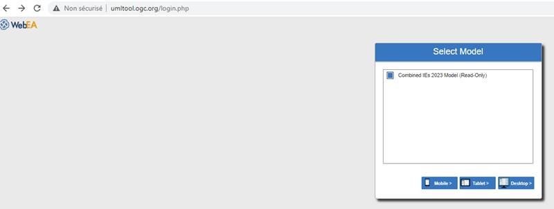
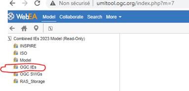
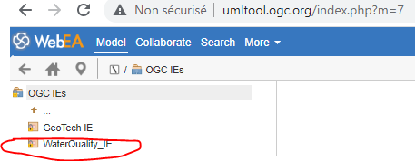
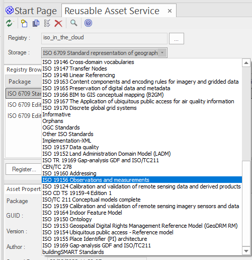
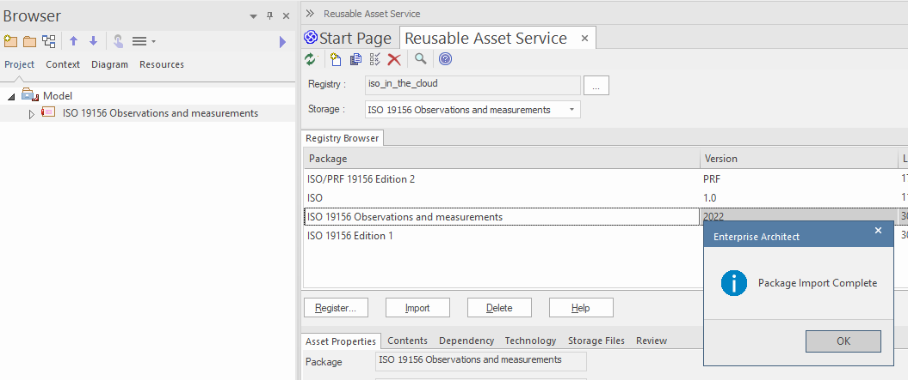
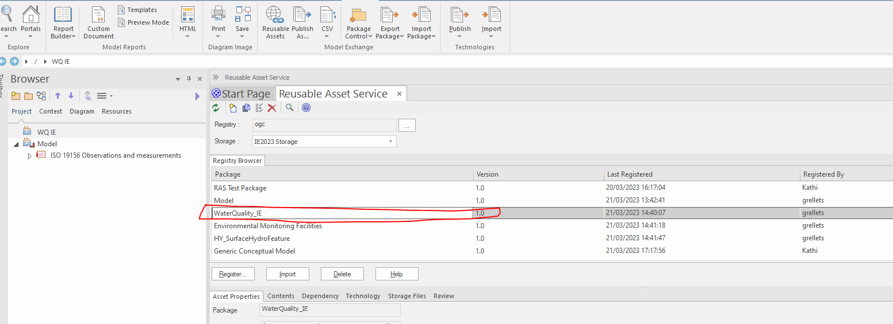
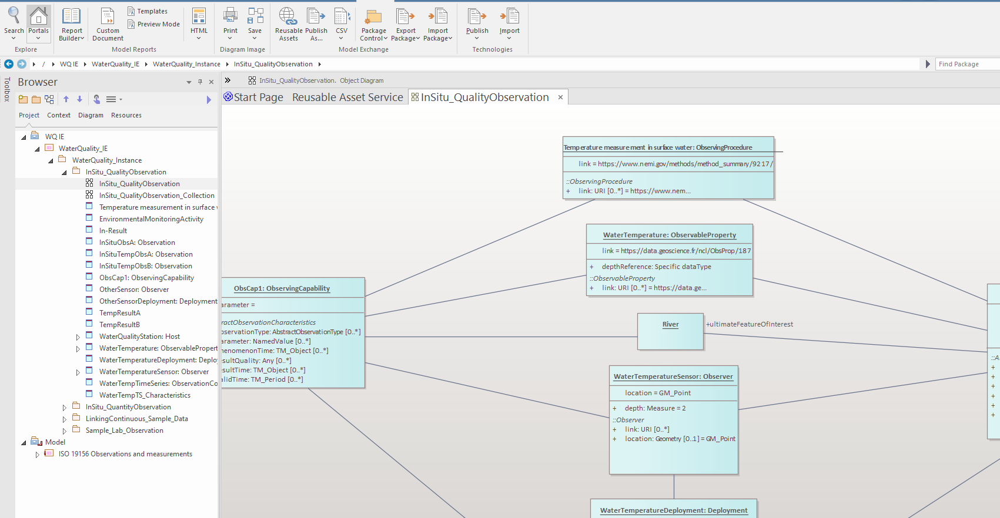

# WebAccess (HTML View)

0. http://umltool.ogc.org/login.php
1. Tick  « Combined IEs 2023 Model (Read-Only) » and choose Desktop (if you’re on a laptop)

2. then ‘OGC IEs’

3. then WaterQuality IE

4. and explore

Note : in all the other diagrams, you can come back using the arrow (just right above ‘GeoTech IE’ in the image above)

# Importing in EA

Sequence of action to do in an EA project using the 'Reusable Asset Service' approach
## Adding ISO 'Observations, Measurements & Samples'

Supporting documentation from ISO : <https://github.com/ISO-TC211/HMMG/wiki#reusable-assets>

1. Clic on 'Publish/Reusable Assets' (circled red on the image below), then enter the ISO configuration (circled purple on the image below)
> Name: iso_in_the_cloud 
> Protocol:http 
> Server:104.130.217.178 
> Port:804 
> Model Name: iso

2. Scroll the Storage down to 'ISO 19156 Observations & measurements'

3. Take the latest version

and clic import (no need to add dependancies)

4. Package import complete and ok looks like this

## Adding OGC  'Water Quality IE modelling work'

That's exactly the same logic.
Just add on another 'root node'

1. Clic on 'Publish/Reusable Assets' (circled red on the image below), then enter the OGC  configuration (circled purple on the image below)
> Name: OGC
> Protocol:https 
> Server:umltool.ogc.org
> Port:1805 
> Model Name: IEs2023

For ReadOnly access, use this
- User : readonly
- Password : OGC.model

2. Pick WaterQuality_IE

and clic import (no need to add dependancies)

3. Package import complete and ok looks like this

## Adding OGC 'HY_Features' model

Follow exactly the same logic.
Note : so far, in the WQ IE, we only use one package of the OGC HY_Features standard. It will be shared more properly at some point (so this may move at some point, then we'll update this How to).

1. Clic on 'Publish/Reusable Assets' (circled red on the image below), then enter the OGC  configuration (circled purple on the image below)
> Name: OGC
> Protocol:https 
> Server:umltool.ogc.org
> Port:1805 
> Model Name: IEs2023

2. Pick HY_SurfaceHydroFeature

and clic import (no need to add dependancies)

## Final imported model should look like this

